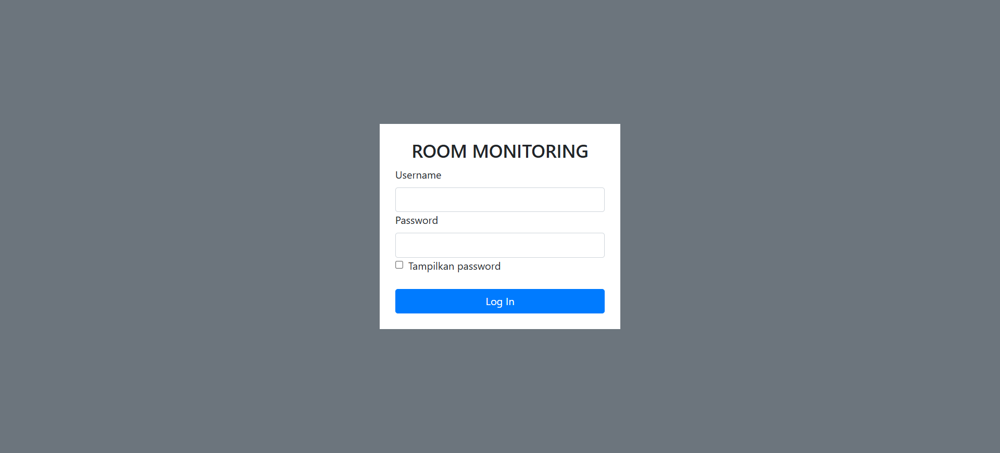
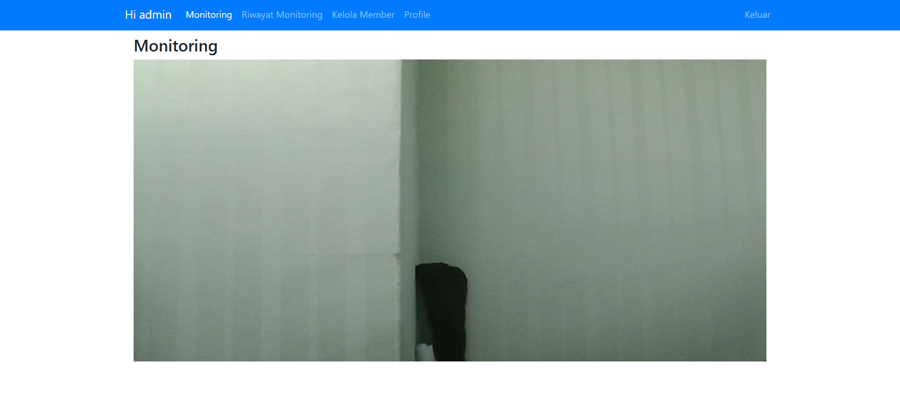
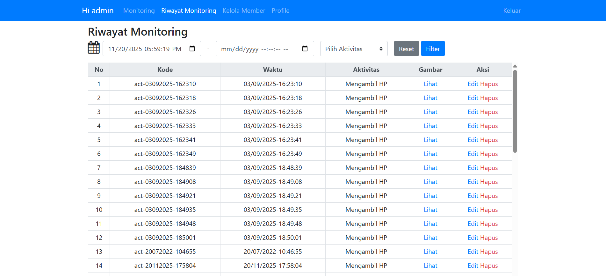
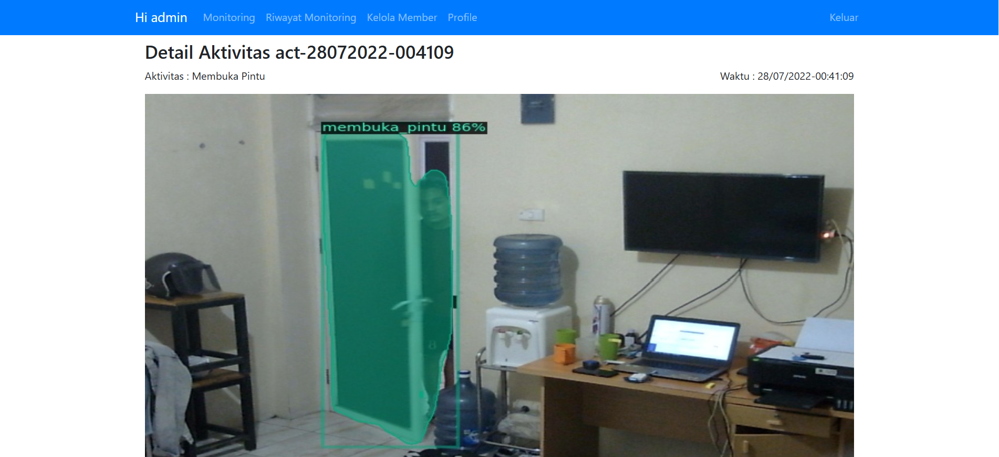

# 🚀 Monitoring (Web App)

Monitoring is a web application designed to monitor activities occurring in a room using real-time video captured via a camera. The captured video is then processed using the Detectron2 library to classify the observed activities.

## ✨ Key Features

* **Real-time Monitoring:** Live video streaming from a camera straight to the web interface..
* **AI Activity Detection::** Uses a custom-trained Detectron2 model to detect and label activities in real-time.
* **User Management:** Authentication system with hashed passwords, differentiating between Admin and Member roles.
* **Monitoring History:** Every detected activity is automatically logged to the database with a timestamp and image proof.
* **Cloud Storage:** Evidence images from detections are uploaded and stored in Firebase Storage.
* **Realtime Database:** Uses Firebase Realtime Database to manage user data and activity logs.

## 💻 Application Preview


*Login page.*

*Monitoring page.*

*History page.*

*Detail page.*

## 🛠️ Tech Stack

The main technologies used in this project include:

* **Frontend:**
    * CSS
    * HTML5
    * JavaScript
    * Jinja2
* **Backend:**
    * Flask
    * Python 3.9+
    * Werkzeug
* **Database:**
    * Firebase Realtime Database
    * Firebase Storage
* **Others:**
    * Detectron2
    * OpenCV
    * PyTorch

## ⚙️ Installation & Setup

Follow these steps to get the project running on your local machine:

1.  **Clone this repository:**
    ```bash
    git clone [https://github.com/fandipres/monitoring.git](https://github.com/fandipres/monitoring.git)
    cd monitoring
    ```

2.  **Create an Anaconda Environment:**
    ```bash
    conda create -n monitoring python=3.9
    conda activate monitoring
    ```

3.  **Install Dependencies:**
    * For CPU-only:
    ```bash
    conda install pytorch torchvision torchaudio cpuonly -c pytorch
    ```
    * For GPU (NVIDIA CUDA):
    ```bash
    conda install pytorch torchvision torchaudio pytorch-cuda=11.8 -c pytorch -c nvidia
    ```
4.  **Install Detectron2 and Other Libraries:**
    * Make sure you have Microsoft C++ Build Tools installed (if on Windows).
    * Install the build dependencies and other Python libraries:
    ```bash
    pip install "git+[https://github.com/facebookresearch/detectron2.git](https://github.com/facebookresearch/detectron2.git)"
    pip install flask firebase-admin opencv-python
    ```

5.  **Database configuration:**

    Place your Firebase config files in the firebase/ folder.

5.  **Run the application:**
    ```bash
    python app.py
    ```

6.  Open your browser and navigate to `http://127.0.0.1:5000` (or the port specified by Vite).

## 🔗 Links

* **Live Demo:** [Not deployed yet]
* **Repository:** [github.com/fandipres/monitoring](https://github.com/fandipres/monitoring)

## 📄 License

This project is licensed under the [MIT License](https://opensource.org/licenses/MIT).